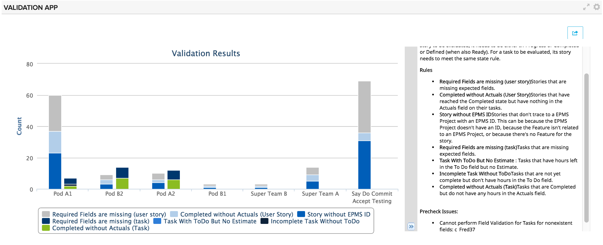

#Validation App

Will display a chart with results of various registered validation rules.

## Development Notes

A validation rule is a class that provides a label name, a query and fields to fetch, 
and a function to apply the rule.  Important methods that can be subclassed:

  * getFetchFields:  return an array of fields that should be fetched when the validator 
  goes to Rally to get the data
  * getFilters: return wsapi filters.  The validator is going to consolidate the filters so
  that the server query can be made at once instead of repeating for each class.  DO NOT 
  rely on this to define the rule, just to limit the data that comes back to be evaluated 
  for the rule.  (The validator will go and get the stories that meet one of the rules (and
  might meet more than one).  Then it will pass all of those stories to the rule class to
  evaluate.  So it WILL need to evaluate items that might have been grabbed in spite of the
  filters.
  
  * applyRuleToRecord:  This is the important one.  A record will be passed to the rule, so 
  return _false_ if the record passes.  Return a string describing the failure if the record 
  fails to pass.  
  
  * getDescription:  This is a good short description that will be added to the bullet list
  of rule descriptions in the app's right slideout.
  * getUserFriendlyRuleLabel: This is a shorter description to be used as the label on the
  chart legend.
  
  * precheckRule:  This will be called by the validator before firing rules against individual
  records.  This is useful for items that depend on a field being available or some other 
  workspace config setting being place so that the app doesn't completely crash when it tries
  to query or whatever during the execution.  This one is optional and is most necessary for
  companies trying to use this in multiple workspaces.
  

### First Load

If you've just downloaded this from github and you want to do development, 
you're going to need to have these installed:

 * node.js
 * grunt-cli
 * grunt-init
 
Since you're getting this from github, we assume you have the command line
version of git also installed.  If not, go get git.

If you have those three installed, just type this in the root directory here
to get set up to develop:

  npm install

### Structure

  * src/javascript:  All the JS files saved here will be compiled into the 
  target html file
  * src/style: All of the stylesheets saved here will be compiled into the 
  target html file
  * test/fast: Fast jasmine tests go here.  There should also be a helper 
  file that is loaded first for creating mocks and doing other shortcuts
  (fastHelper.js) **Tests should be in a file named <something>-spec.js**
  * test/slow: Slow jasmine tests go here.  There should also be a helper
  file that is loaded first for creating mocks and doing other shortcuts 
  (slowHelper.js) **Tests should be in a file named <something>-spec.js**
  * templates: This is where templates that are used to create the production
  and debug html files live.  The advantage of using these templates is that
  you can configure the behavior of the html around the JS.
  * config.json: This file contains the configuration settings necessary to
  create the debug and production html files.  
  * package.json: This file lists the dependencies for grunt
  * auth.json: This file should NOT be checked in.  Create this to create a
  debug version of the app, to run the slow test specs and/or to use grunt to
  install the app in your test environment.  It should look like:
    {
        "username":"you@company.com",
        "password":"secret",
        "server": "https://rally1.rallydev.com"
    }
  
### Usage of the grunt file
####Tasks
    
##### grunt debug

Use grunt debug to create the debug html file.  You only need to run this when you have added new files to
the src directories.

##### grunt build

Use grunt build to create the production html file.  We still have to copy the html file to a panel to test.

##### grunt test-fast

Use grunt test-fast to run the Jasmine tests in the fast directory.  Typically, the tests in the fast 
directory are more pure unit tests and do not need to connect to Rally.

##### grunt test-slow

Use grunt test-slow to run the Jasmine tests in the slow directory.  Typically, the tests in the slow
directory are more like integration tests in that they require connecting to Rally and interacting with
data.

##### grunt deploy

Use grunt deploy to build the deploy file and then install it into a new page/app in Rally.  It will create the page on the Home tab and then add a custom html app to the page.  The page will be named using the "name" key in the config.json file (with an asterisk prepended).

To use this task, you must create an auth.json file that contains the following keys:
{
    "username": "fred@fred.com",
    "password": "fredfredfred",
    "server": "https://us1.rallydev.com"
}

(Use your username and password, of course.)  NOTE: not sure why yet, but this task does not work against the demo environments.  Also, .gitignore is configured so that this file does not get committed.  Do not commit this file with a password in it!

When the first install is complete, the script will add the ObjectIDs of the page and panel to the auth.json file, so that it looks like this:

{
    "username": "fred@fred.com",
    "password": "fredfredfred",
    "server": "https://us1.rallydev.com",
    "pageOid": "52339218186",
    "panelOid": 52339218188
}

On subsequent installs, the script will write to this same page/app. Remove the
pageOid and panelOid lines to install in a new place.  CAUTION:  Currently, error checking is not enabled, so it will fail silently.

##### grunt watch

Run this to watch files (js and css).  When a file is saved, the task will automatically build and deploy as shown in the deploy section above.

